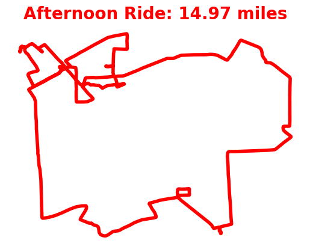

# StravaPrint

## Purpose
A silly little project to convert poyline data from Strava to a dithered image to be printed on thermal paper.

## Materials Needed

- Cat Thermal Printer
- Strava account

## Goals Checklist

- [x] Strava API Authorization
  - [Strava Auth Module](strava_auth.py)

- [x] Retreive polyline data from latest activity on Strava
  - [Strava poloyline data retrevial - def get_polyline_data(access_token, page)](gen_strava_map.py)

- [x] Generate basic PNG image plot of activity polyline
  - 

- [ ] Create dithered image for printing

- [ ] Print to cat mini thermal printer
